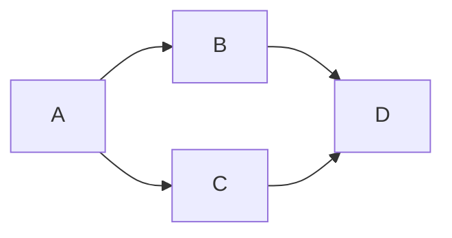

# Flexivis

Flexivis is a flexible visualisation tool that allows you to easily visualise diverse types of data in Web browser.

<ul>
    <li><a href="#overview">Overview</a></li>
    <li><a href="#layout">Layout</a></li>
    <li><a href="#view-specifications">View specifications</a></li>
    <li class="hide-in-app"><a href="#development">Development</a></li>
</ul>


## Overview

Flexivis combines two main abilities:
- Render or visualise many types of data.
- Lay out multiple views into sub-regions of the browser window.

Using Flexivis is simple:
1. You build a Flexivis URL that describes the various views you'd like to display and optionally the layout that should be used to combine them.
2. Nagivating to that URL displays the rendered layout.


Here's an [example Flexivis URL]:
```
https://flexivis.infrastruktur.link?layout=(explanation30-map)/source&explanation=md:https://raw.githubusercontent.com/programmiersportgruppe/flexivis/master/docs/samples/berlin-walk.md&map=map:https://raw.githubusercontent.com/programmiersportgruppe/flexivis/master/docs/samples/berlin-walk.json&source=json:https://raw.githubusercontent.com/programmiersportgruppe/flexivis/master/docs/samples/berlin-walk.json
```

[example Flexivis URL]: https://flexivis.infrastruktur.link?layout=(explanation30-map)/source&explanation=md:https://raw.githubusercontent.com/programmiersportgruppe/flexivis/master/docs/samples/berlin-walk.md&map=map:https://raw.githubusercontent.com/programmiersportgruppe/flexivis/master/docs/samples/berlin-walk.json&source=json:https://raw.githubusercontent.com/programmiersportgruppe/flexivis/master/docs/samples/berlin-walk.json

It renders something like this:

[](https://flexivis.infrastruktur.link?layout=(explanation30-map)/source&explanation=md:https://raw.githubusercontent.com/programmiersportgruppe/flexivis/master/docs/samples/berlin-walk.md&map=map:https://raw.githubusercontent.com/programmiersportgruppe/flexivis/master/docs/samples/berlin-walk.json&source=json:https://raw.githubusercontent.com/programmiersportgruppe/flexivis/master/docs/samples/berlin-walk.json)

At first glance, the URL above is quite a mouthful, but it's actually not very complicated. Let's break it down. Without the query string, the URL is simply https://flexivis.infrastruktur.link/, which is Flexivis's base URL. There are then 4 query string parameters:
- layout=(explanation30-map)/source
- explanation=md:https://raw.githubusercontent.com/programmiersportgruppe/flexivis/master/docs/samples/berlin-walk.md
- map=map:https://raw.githubusercontent.com/programmiersportgruppe/flexivis/master/docs/samples/berlin-walk.json
- source=json:https://raw.githubusercontent.com/programmiersportgruppe/flexivis/master/docs/samples/berlin-walk.json

The [`layout`](#layout) parameter specifies how to lay out the named views in the available screen real estate. The other 3 parameters each provide a named [view specification](#view-specifications).


## Layout

The optional `layout` parameter specifies how to lay out the individual views in the available screen real estate.

<table>
    <tr>
        <td style="min-width: 90px"></td>
        <td>A single view is specified by its name (containing only alphanumeric characters), e.g. <code>layout=foo</code>.</td>
    </tr>
    <tr>
        <td></td>
        <td>When there is no <code>layout</code> parameter, <code>layout=url</code> is implied.</td>
    </tr>
    <tr>
        <td></td>
        <td>Views can be layed out side-by-side with the <code>/</code> operator: <code>layout=foo/bar</code>.</td>
    </tr>
    <tr>
        <td></td>
        <td>Views can be layed out in a vertical stack with the <code>-</code> operator: <code>layout=foo-bar-baz</code>.</td>
    </tr>
    <tr>
        <td></td>
        <td>Parentheses can be used for grouping: <code>layout=foo/(bar-baz)</code>.</td>
    </tr>
    <tr>
        <td></td>
        <td>A number immediately after a view specifies the percentage of the parent view that it will occupy,<br/> with the remaining percentage distributed amongst views without an explicit percentage:<br/> <code>layout=foo/(bar40-baz)75</code>.</td>
    </tr>
</table>


## View Specifications

All query parameters other than the [`layout`](#layout) parameter specifiy individual views.
The parameter name is the name of the view (which can then be used in the `layout` parameter), and the value is a view specification.

The basic format of a view specification is `<prefix>:<url-and-view-specific-params>`.

The prefix specifies the view type. The following view types are supported:

- [`json`: Interactive JSON viewer](#json)
- [`mermaid`: Mermaid diagrams](#mermaid)
- [`text`: Plaintext](#text)
- [`vega`: Vega/Vega-Lite graphs](#vega)

_TODO: Document remaining view specification types._

### `json`

The `json` prefix specifies that the resource is a JSON document and should be rendered in a JSON viewer.

E.g.: [JSON file](http://flexivis.infrastruktur.link/?url=json:https://raw.githubusercontent.com/programmiersportgruppe/flexivis/master/docs/samples/berlin-walk.json).

### `mermaid`

The `mermaid` prefix renders [Mermaid](https://mermaid-js.github.io/mermaid) diagrams. You can either pass
an URL to a file containing a diagram or use the `mermaid-inline` prefix and pass a URL-encoded string
containing the diagram's definition.

E.g. [render a diagram](http://flexivis.infrastruktur.link/?url=mermaid-inline:graph%20LR%0A%20%20%20A%20--%3E%20B%20%26%20C--%3E%20D) for the following example:



### `text`

The `text` prefix specifies that the resource at the given URL should be rendered as plain text.

E.g.: [plaintext JSON file](http://flexivis.infrastruktur.link/?url=text:https://raw.githubusercontent.com/programmiersportgruppe/flexivis/master/docs/samples/berlin-walk.json).


### `vega`

The `vega` prefix specifies that the URL represents a [Vega](https://vega.github.io/vega/) or [Vega-Lite](https://vega.github.io/vega-lite/) graph.

E.g.: [visualise # of files vs lines of code](http://flexivis.infrastruktur.link/?layout=(graph-data)/source&graph=vega:https://raw.githubusercontent.com/programmiersportgruppe/flexivis/master/docs/samples/cloc.json&source=json:https://raw.githubusercontent.com/programmiersportgruppe/flexivis/master/docs/samples/cloc.json&data=text:https://raw.githubusercontent.com/programmiersportgruppe/flexivis/master/docs/samples/cloc.csv) (as reported by [cloc]()).


<div class="hide-following-in-app"></div>

## Development

### Setup

```bash
npm install
gem install s3_website
```

### Deploy

```bash
npm run build
s3_website push
```
