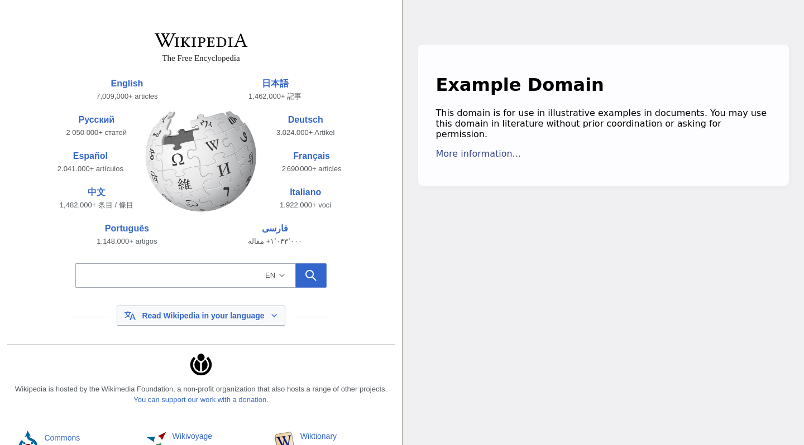
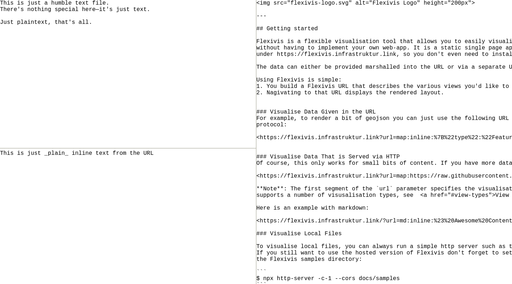
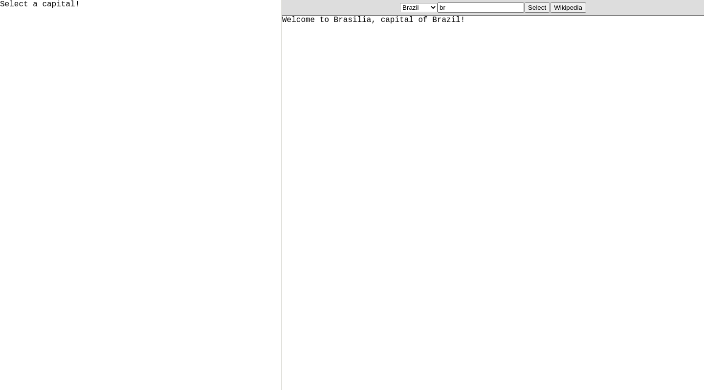
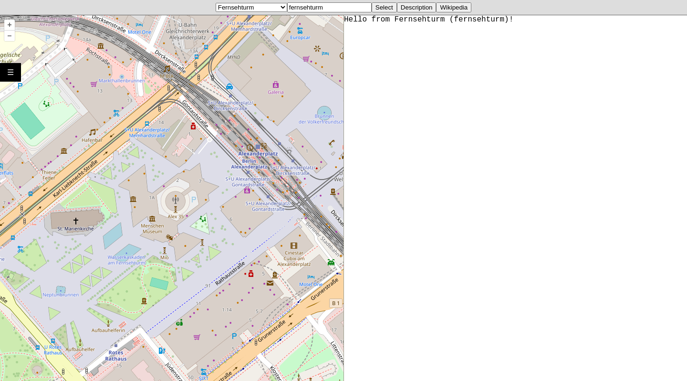

# Flexivis

Flexivis is a flexible visualisation tool that allows you to easily visualise diverse types of data in Web browser.

<ul>
    <li><a href="#overview">Overview</a></li>
    <li><a href="#layout">Layout</a></li>
    <li>
        <a href="#view-specifications">View specifications</a>
        <!-- BEGIN view specifications table of contents -->
        <ul>
            <li><a href="#regular-content">Regular Content</a></li>
            <li><a href="#markdown">Markdown</a></li>
            <li><a href="#json">JSON</a></li>
            <li><a href="#text">Text</a></li>
            <li><a href="#map">Map</a></li>
            <li><a href="#mermaid-diagrams">Mermaid Diagrams</a></li>
            <li><a href="#vega-graphs">Vega Graphs</a></li>
            <li><a href="#item-select">Item Select</a></li>
        </ul>
        <!-- END view specifications table of contents -->
    </li>
    <li class="hide-in-app"><a href="#development">Development</a></li>
</ul>


## Overview

Flexivis combines two main abilities:
- Render or visualise many types of data.
- Lay out multiple views into sub-regions of the browser window.

Using Flexivis is simple:
1. You build a Flexivis URL that describes the various views you'd like to display and optionally the layout that should be used to combine them.
2. Nagivating to that URL displays the rendered layout.


Here's an [example Flexivis URL]:
```
https://flexivis.infrastruktur.link?layout=(explanation30-map)/source&explanation=md:https://raw.githubusercontent.com/programmiersportgruppe/flexivis/master/docs/samples/berlin-walk.md&map=map:https://raw.githubusercontent.com/programmiersportgruppe/flexivis/master/docs/samples/berlin-walk.json&source=json:https://raw.githubusercontent.com/programmiersportgruppe/flexivis/master/docs/samples/berlin-walk.json
```

[example Flexivis URL]: https://flexivis.infrastruktur.link?layout=(explanation30-map)/source&explanation=md:https://raw.githubusercontent.com/programmiersportgruppe/flexivis/master/docs/samples/berlin-walk.md&map=map:https://raw.githubusercontent.com/programmiersportgruppe/flexivis/master/docs/samples/berlin-walk.json&source=json:https://raw.githubusercontent.com/programmiersportgruppe/flexivis/master/docs/samples/berlin-walk.json

It renders something like this:

<a href="https://flexivis.infrastruktur.link?layout=(explanation30-map)/source&explanation=md:https://raw.githubusercontent.com/programmiersportgruppe/flexivis/master/docs/samples/berlin-walk.md&map=map:https://raw.githubusercontent.com/programmiersportgruppe/flexivis/master/docs/samples/berlin-walk.json&source=json:https://raw.githubusercontent.com/programmiersportgruppe/flexivis/master/docs/samples/berlin-walk.json"></a>

At first glance, the URL above is quite a mouthful, but it's actually not very complicated. Let's break it down. Without the query string, the URL is simply https://flexivis.infrastruktur.link/, which is Flexivis's base URL. There are then 4 query string parameters:
- layout=(explanation30-map)/source
- explanation=md:https://raw.githubusercontent.com/programmiersportgruppe/flexivis/master/docs/samples/berlin-walk.md
- map=map:https://raw.githubusercontent.com/programmiersportgruppe/flexivis/master/docs/samples/berlin-walk.json
- source=json:https://raw.githubusercontent.com/programmiersportgruppe/flexivis/master/docs/samples/berlin-walk.json

The [`layout`](#layout) parameter specifies how to lay out the named views in the available screen real estate. The other 3 parameters each provide a named [view specification](#view-specifications).


## Layout

The optional `layout` parameter specifies how to lay out the individual views in the available screen real estate.

<table>
    <tr>
        <td style="min-width: 90px"></td>
        <td>A single view is specified by its name (containing only alphanumeric characters), e.g. <code>layout=foo</code>.</td>
    </tr>
    <tr>
        <td></td>
        <td>When there is no <code>layout</code> parameter, <code>layout=url</code> is implied.</td>
    </tr>
    <tr>
        <td></td>
        <td>Views can be layed out side-by-side with the <code>/</code> operator: <code>layout=foo/bar</code>.</td>
    </tr>
    <tr>
        <td></td>
        <td>Views can be layed out in a vertical stack with the <code>-</code> operator: <code>layout=foo-bar-baz</code>.</td>
    </tr>
    <tr>
        <td></td>
        <td>Parentheses can be used for grouping: <code>layout=foo/(bar-baz)</code>.</td>
    </tr>
    <tr>
        <td></td>
        <td>A number immediately after a view specifies the percentage of the parent view that it will occupy,<br/> with the remaining percentage distributed amongst views without an explicit percentage:<br/> <code>layout=foo/(bar40-baz)75</code>.</td>
    </tr>
</table>

A detailed specification of the layout format can be found [here](docs/grammar/layout.md).


## View Specifications

All query parameters other than the [`layout`](#layout) parameter specify individual views.
The parameter name is the name of the view (which can then be used in the `layout` parameter), and the value is a view specification.

The basic format of a view specification is `<prefix>:<resource>`. The prefix specifies the view type. Optionally, configurations can be passed to both the view or the resources listed before the value, for example: `(abc=123;xyz=789)<prefix>:(hello=true;hide)<resource>`. A detailed specification of the view format is available [here](docs/grammar/view.md).

The following view types are supported:

<!-- BEGIN view specifications -->
<ul>
    <li><a href="#regular-content">Regular Content</a></li>
    <li><a href="#markdown">Markdown</a></li>
    <li><a href="#json">JSON</a></li>
    <li><a href="#text">Text</a></li>
    <li><a href="#map">Map</a></li>
    <li><a href="#mermaid-diagrams">Mermaid Diagrams</a></li>
    <li><a href="#vega-graphs">Vega Graphs</a></li>
    <li><a href="#item-select">Item Select</a></li>
</ul>


### Regular Content

View specification prefixes: `http`, `https`, `file`.

HTTP/S URLs can be loaded and displayed in IFrames.

```
https://flexivis.infrastruktur.link/?layout=a/b&a=https://wikipedia.org&b=https://example.com
```

<a href="https://flexivis.infrastruktur.link/?layout=a/b&amp;a=https://wikipedia.org&amp;b=https://example.com"></a>

If your browser environment permits it (e.g. if you build Flexivis locally and open it from a `file:` URL), you can also load content from `file:` URLs. This can be useful to visualise build outputs, for example.

```
https://flexivis.infrastruktur.link/?layout=a/b&a=file://results.html&b=file://generated-image.png
```


### Markdown

View specification prefixes: `md`, `md-inline`.

Render [Markdown](https://en.wikipedia.org/wiki/Markdown) content.

```
https://flexivis.infrastruktur.link/?layout=a/b&a=md:https://raw.githubusercontent.com/programmiersportgruppe/flexivis/master/docs/samples/markdown.md&b=md-inline:This pane contains **inline** Markdown content taken _from the URL_.
```

<a href="https://flexivis.infrastruktur.link/?layout=a/b&amp;a=md:https://raw.githubusercontent.com/programmiersportgruppe/flexivis/master/docs/samples/markdown.md&amp;b=md-inline:This pane contains **inline** Markdown content taken _from the URL_."></a>


### JSON

View specification prefixes: `json`, `json-inline`.

Render JSON in an interactive viewer.

```
https://flexivis.infrastruktur.link/?layout=a/b&a=json:https://raw.githubusercontent.com/programmiersportgruppe/flexivis/master/package-lock.json&b=json-inline:{"name": "inline JSON example", "id": 42, "values": ["foo", "baz", "bar"]}
```

<a href="https://flexivis.infrastruktur.link/?layout=a/b&amp;a=json:https://raw.githubusercontent.com/programmiersportgruppe/flexivis/master/package-lock.json&amp;b=json-inline:{&quot;name&quot;: &quot;inline JSON example&quot;, &quot;id&quot;: 42, &quot;values&quot;: [&quot;foo&quot;, &quot;baz&quot;, &quot;bar&quot;]}"></a>


### Text

View specification prefixes: `text`, `text-inline`.

Display plain text. This can be used to display the source of a visualisation alongside the visualisation itself.

```
https://flexivis.infrastruktur.link/?layout=(a-b)/c&a=text:https://raw.githubusercontent.com/programmiersportgruppe/flexivis/master/docs/samples/plaintext.txt&b=text-inline:This is just _plain_ inline text from the URL&c=text:https://raw.githubusercontent.com/programmiersportgruppe/flexivis/master/README.md
```

<a href="https://flexivis.infrastruktur.link/?layout=(a-b)/c&amp;a=text:https://raw.githubusercontent.com/programmiersportgruppe/flexivis/master/docs/samples/plaintext.txt&amp;b=text-inline:This is just _plain_ inline text from the URL&amp;c=text:https://raw.githubusercontent.com/programmiersportgruppe/flexivis/master/README.md"></a>


### Map

View specification prefix: `map`.

Renders GeoJSON documents on an interactive map.

The view allows the following configurations:

- `center`: the latitude/longitude to center the map, e.g. `52.554101,13.463528`.
- `zoomLevel`: the zoom level of the map.
- `layer`: the layer type.

The resources can also be configured:

- `hidden`: initially hide this resource.
- `id`: an ID for the resource.

The following view definition exemplifies how how to use the configurations:

```
(center=52.554101,13.463528;zoomLevel=16;layer=osm)map:(id=walk;hidden)https://raw.githubusercontent.com/programmiersportgruppe/flexivis/master/docs/samples/berlin-walk.json
```

Multiple resources can be displayed at once by separating them with `;`.


```
https://flexivis.infrastruktur.link/?layout=a/b&a=map:https://raw.githubusercontent.com/programmiersportgruppe/flexivis/master/docs/samples/berlin-walk.json&b=text:https://raw.githubusercontent.com/programmiersportgruppe/flexivis/master/docs/samples/berlin-walk.json
```

<a href="https://flexivis.infrastruktur.link/?layout=a/b&amp;a=map:https://raw.githubusercontent.com/programmiersportgruppe/flexivis/master/docs/samples/berlin-walk.json&amp;b=text:https://raw.githubusercontent.com/programmiersportgruppe/flexivis/master/docs/samples/berlin-walk.json"></a>


### Mermaid Diagrams

View specification prefixes: `mermaid`, `mermaid-inline`.

Renders [mermaid](https://mermaid-js.github.io/mermaid/) diagrams.

```
https://flexivis.infrastruktur.link/?layout=(a-b)/c&a=mermaid:https://raw.githubusercontent.com/programmiersportgruppe/flexivis/master/docs/samples/mermaid.mmd&b=text:https://raw.githubusercontent.com/programmiersportgruppe/flexivis/master/docs/samples/mermaid.mmd&c=mermaid-inline:graph TB; p[mermaid-inline prefix] --> URL; s[Mermaid source] --> URL -->%7CFlexivis%7C r[Rendered Diagram]
```

<a href="https://flexivis.infrastruktur.link/?layout=(a-b)/c&amp;a=mermaid:https://raw.githubusercontent.com/programmiersportgruppe/flexivis/master/docs/samples/mermaid.mmd&amp;b=text:https://raw.githubusercontent.com/programmiersportgruppe/flexivis/master/docs/samples/mermaid.mmd&amp;c=mermaid-inline:graph TB; p[mermaid-inline prefix] --> URL; s[Mermaid source] --> URL -->%7CFlexivis%7C r[Rendered Diagram]"></a>


### Vega Graphs

View specification prefixes: `vega`, `vega-inline`.

Renders [Vega](https://vega.github.io/vega/) and [Vega-Lite](https://vega.github.io/vega-lite/) graphs.

```
https://flexivis.infrastruktur.link/?layout=(a-c30)/b&a=vega:https://raw.githubusercontent.com/programmiersportgruppe/flexivis/master/docs/samples/cloc.json&b=text:https://raw.githubusercontent.com/programmiersportgruppe/flexivis/master/docs/samples/cloc.json&c=text:https://raw.githubusercontent.com/programmiersportgruppe/flexivis/master/docs/samples/cloc.csv
```

<a href="https://flexivis.infrastruktur.link/?layout=(a-c30)/b&amp;a=vega:https://raw.githubusercontent.com/programmiersportgruppe/flexivis/master/docs/samples/cloc.json&amp;b=text:https://raw.githubusercontent.com/programmiersportgruppe/flexivis/master/docs/samples/cloc.json&amp;c=text:https://raw.githubusercontent.com/programmiersportgruppe/flexivis/master/docs/samples/cloc.csv"></a>

You can specify the graph by putting JSON in the URL. The JSON can then load values by URL (like the JSON shown in the previous example), or you can embed the values in the JSON.

```
https://flexivis.infrastruktur.link/?url=vega-inline:{"data": {"values": [{"factor": "awesomeness", "score": 10}, {"factor": "weirdness", "score": 3}, {"factor": "color", "score": 7}]}, "mark": "bar", "encoding": {"x": {"field": "factor", "type": "nominal"}, "y": {"field": "score", "type": "quantitative"}, "color": {"field": "factor", "type": "nominal"}}, "height": "container", "width": 100}
```

<a href="https://flexivis.infrastruktur.link/?url=vega-inline:{&quot;data&quot;: {&quot;values&quot;: [{&quot;factor&quot;: &quot;awesomeness&quot;, &quot;score&quot;: 10}, {&quot;factor&quot;: &quot;weirdness&quot;, &quot;score&quot;: 3}, {&quot;factor&quot;: &quot;color&quot;, &quot;score&quot;: 7}]}, &quot;mark&quot;: &quot;bar&quot;, &quot;encoding&quot;: {&quot;x&quot;: {&quot;field&quot;: &quot;factor&quot;, &quot;type&quot;: &quot;nominal&quot;}, &quot;y&quot;: {&quot;field&quot;: &quot;score&quot;, &quot;type&quot;: &quot;quantitative&quot;}, &quot;color&quot;: {&quot;field&quot;: &quot;factor&quot;, &quot;type&quot;: &quot;nominal&quot;}}, &quot;height&quot;: &quot;container&quot;, &quot;width&quot;: 100}"></a>


### Item Select

View specification prefixes: `select`, `select-inline`.

Accepts a list of items, and displays a customized view for each selection.

This view expects a JSON resource with the following basic format:

```json
{
  "items": [ ... ],
  "parameters": { ... },
  "modals": { ... }
}
```

`items` contain multiple JSON objects. Each object must contain an `id` field that uniquely identifies that item.
Although optional, the field called `label` is also special. If set, that will the display name used by the Select view.
Besides that, the objects can contain any other desired fields and values. The following is a valid example of the field:

```json
{
  "items": [
    { "id": "de", "label": "Germany", "capital": "Berlin" },
    { "id": "ca", "label": "Canada", "capital": "Ottawa" },
    { "id": "br", "label": "Brazil", "capital": "Brasilia" }
  ]
}
```

`parameters` contains parameters that follow the URL parameter format accepted by Flexivis. However, they can also contain
template expressions expresses by `${field}`, where the field is part of the items. For example:

```json
{
  "parameters": {
    "layout": "a",
    "a": "text-inline:Welcome to ${capital}, capital of ${label}!"
  }
}
```

`modals` contains a list of modals that can be shown with further details for each item. For every modal defined, a button will
be added to the page, using the key as the button label, and the value as the modal's view type. For instance:

```json
{
  "modals": {
    "Wikipedia": "https://en.wikipedia.org/wiki/${capital}"
  }
}
```

The view permits the user to define the item that is initially selected by specifying the item's id under the `default` key.


```
https://flexivis.infrastruktur.link/?layout=banner/capitals60&banner=text-inline:Select%20a%20capital!&capitals=(default=br)select-inline:{%20%22items%22:%20[%20{%20%22id%22:%20%22de%22,%20%22label%22:%20%22Germany%22,%20%22capital%22:%20%22Berlin%22%20},%20{%20%22id%22:%20%22ca%22,%20%22label%22:%20%22Canada%22,%20%22capital%22:%20%22Ottawa%22%20},%20{%20%22id%22:%20%22br%22,%20%22label%22:%20%22Brazil%22,%20%22capital%22:%20%22Brasilia%22%20}%20],%20%22parameters%22:%20{%20%22layout%22:%20%22a%22,%20%22a%22:%20%22text-inline:Welcome%20to%20${capital},%20capital%20of%20${label}!%22%20},%20%22modals%22:%20{%20%22Wikipedia%22:%20%22https://en.wikipedia.org/wiki/${capital}%22%20}%20}
```

<a href="https://flexivis.infrastruktur.link/?layout=banner/capitals60&amp;banner=text-inline:Select%20a%20capital!&amp;capitals=(default=br)select-inline:{%20%22items%22:%20[%20{%20%22id%22:%20%22de%22,%20%22label%22:%20%22Germany%22,%20%22capital%22:%20%22Berlin%22%20},%20{%20%22id%22:%20%22ca%22,%20%22label%22:%20%22Canada%22,%20%22capital%22:%20%22Ottawa%22%20},%20{%20%22id%22:%20%22br%22,%20%22label%22:%20%22Brazil%22,%20%22capital%22:%20%22Brasilia%22%20}%20],%20%22parameters%22:%20{%20%22layout%22:%20%22a%22,%20%22a%22:%20%22text-inline:Welcome%20to%20${capital},%20capital%20of%20${label}!%22%20},%20%22modals%22:%20{%20%22Wikipedia%22:%20%22https://en.wikipedia.org/wiki/${capital}%22%20}%20}"></a>

```
https://flexivis.infrastruktur.link/?url=select:https://raw.githubusercontent.com/programmiersportgruppe/flexivis/master/docs/samples/select-view.json
```

<a href="https://flexivis.infrastruktur.link/?url=select:https://raw.githubusercontent.com/programmiersportgruppe/flexivis/master/docs/samples/select-view.json"></a>
<!-- END view specifications -->


<div class="hide-following-in-app"></div>

## Development

### Setup

```bash
npm install
gem install s3_website
```

### Deploy

```bash
npm run build
s3_website push
```
