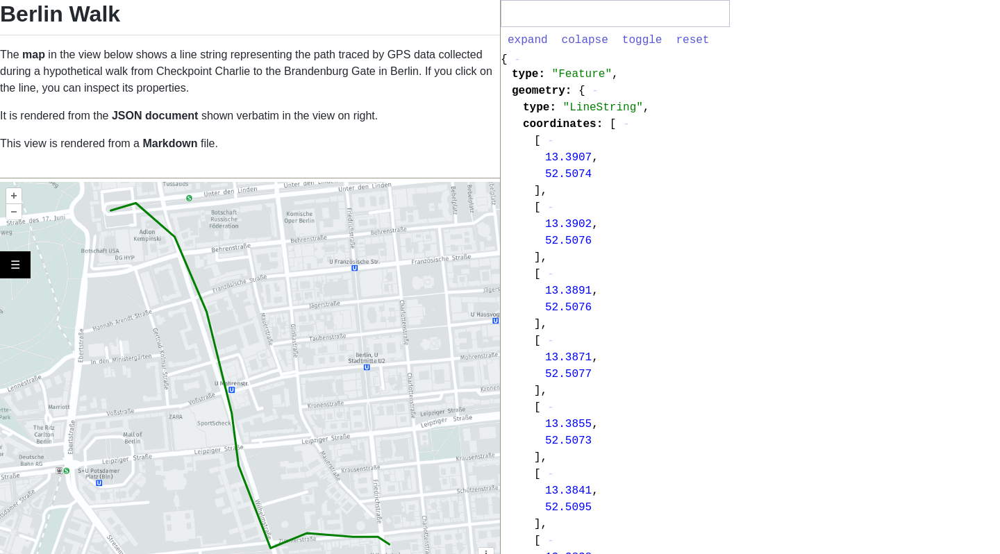
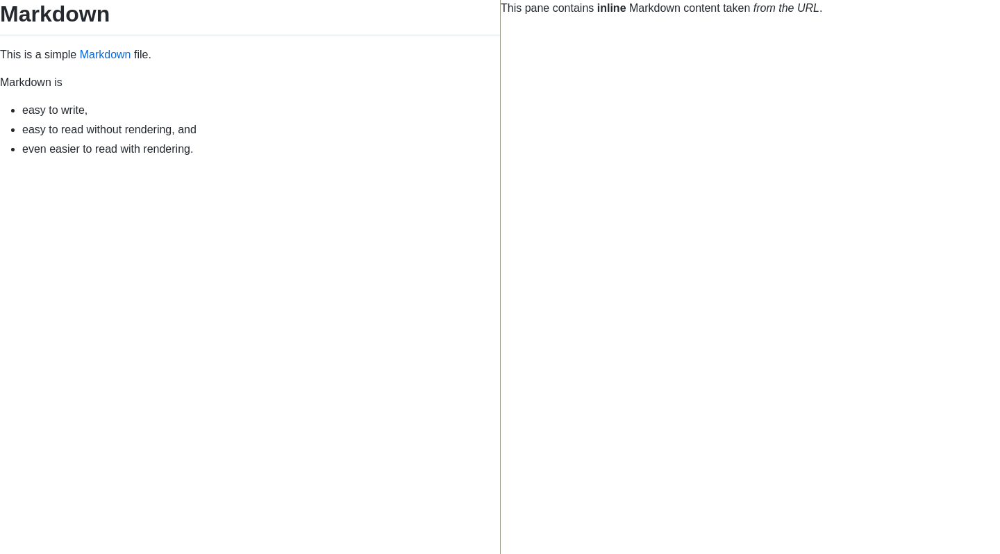
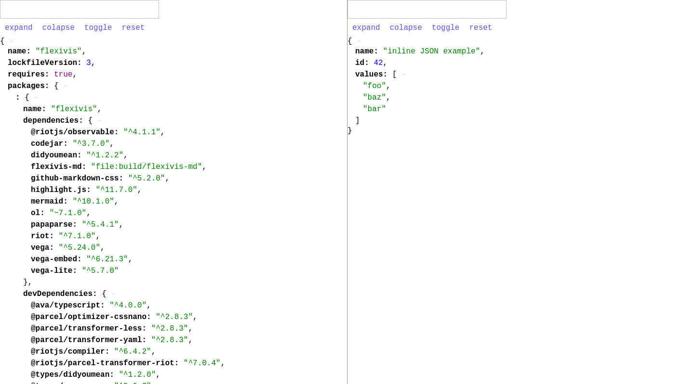
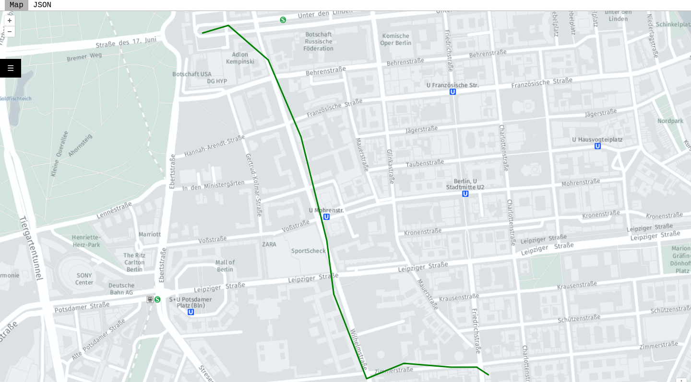
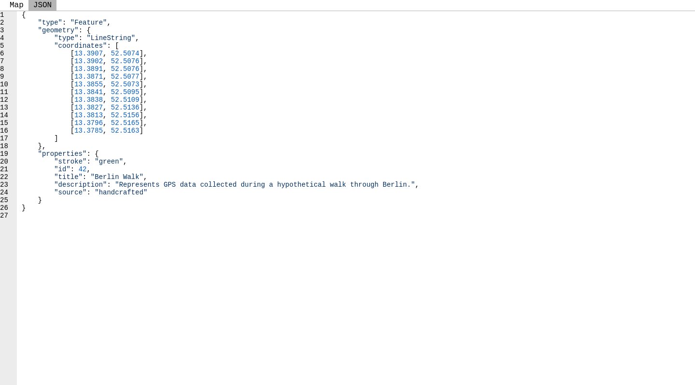

---

## Getting started

Flexivis is a flexible visualisation tool that allows you to easily visualise diverse types of data in a Web browser
without having to implement your own web-app. It is a static single page app that is also served 
under https://flexivis.infrastruktur.link, so you don't even need to install it yourself.

The data can either be provided marshalled into the URL or via a separate URL. Using 

Using Flexivis is simple:
1. You build a Flexivis URL that describes the various views you'd like to display and optionally the layout that should be used to combine them.
2. Nagivating to that URL displays the rendered layout.


### Visualise Data Given in the URL
For example, to render a bit of geojson you can just use the following URL containing the data using the `inline` pseudo
protocol: 

<https://flexivis.infrastruktur.link?url=map:inline:%7B%22type%22:%22Feature%22,%22geometry%22:%7B%22type%22:%22LineString%22,%22coordinates%22:%5B%5B13.3907,52.5074%5D,%5B13.3902,52.5076%5D,%5B13.3891,52.5076%5D,%5B13.3871,52.5077%5D,%5B13.3855,52.5073%5D,%5B13.3841,52.5095%5D%5D%7D,%22properties%22:%7B%22stroke%22:%22green%22%7D%7D>


### Visualise Data That is Served via HTTP
Of course, this only works for small bits of content. If you have more data you can also point Flexivis to an HTTP URL:

<https://flexivis.infrastruktur.link?url=map:https://raw.githubusercontent.com/programmiersportgruppe/flexivis/master/docs/samples/berlin-walk.json>

**Note**: The first segment of the `url` parameter specifies the visualisation type here we use map for geojson. Flexivis
supports a number of visusalisation types, see  <a href="#view-types">View Types</a>

Here is an example with markdown:

<https://flexivis.infrastruktur.link/?url=md:inline:%23%20Awesome%20Content%0AMakes%20for%20a%20nice%20read.> 

### Visualise Local Files

To visualise local files, you can always run a simple http server such as the node based [http-server](https://www.npmjs.com/package/http-server) that exposes parts of your file system.
If you still want to use the hosted version of Flexivis don't forget to set CORS-Headers. Here is how you would serve
the Flexivis samples directory:

```
$ npx http-server -c-1 --cors docs/samples
```

Now the following URL will render the berlin-walk.json example from the local file system:
```
https://flexivis.infrastruktur.link/?url=map:http://localhost:8080/docs/samples/berlin-walk.json
```

### Adding Layout   

As mentioned earlier, Flexivis can also arrange multiple views. Here is a simple example, which shows a rendered geojson file, 
its source and a rendered markdown file side by side:

<https://flexivis.infrastruktur.link?layout=(explanation30-map)/source&explanation=md:https://raw.githubusercontent.com/programmiersportgruppe/flexivis/master/docs/samples/berlin-walk.md&map=map:https://raw.githubusercontent.com/programmiersportgruppe/flexivis/master/docs/samples/berlin-walk.json&source=json:https://raw.githubusercontent.com/programmiersportgruppe/flexivis/master/docs/samples/berlin-walk.json>

It renders something like this:

<a href="https://flexivis.infrastruktur.link?layout=(explanation30-map)/source&explanation=md:https://raw.githubusercontent.com/programmiersportgruppe/flexivis/master/docs/samples/berlin-walk.md&map=map:https://raw.githubusercontent.com/programmiersportgruppe/flexivis/master/docs/samples/berlin-walk.json&source=json:https://raw.githubusercontent.com/programmiersportgruppe/flexivis/master/docs/samples/berlin-walk.json"></a>

At first glance, the URL above is quite a mouthful, but it's actually not very complicated. Let's break it down. Without the query string, the URL is simply https://flexivis.infrastruktur.link/, which is Flexivis's base URL. There are then 4 query string parameters:
- layout=(explanation30-map)/source
- explanation=md:https://raw.githubusercontent.com/programmiersportgruppe/flexivis/master/docs/samples/berlin-walk.md
- map=map:https://raw.githubusercontent.com/programmiersportgruppe/flexivis/master/docs/samples/berlin-walk.json
- source=json:https://raw.githubusercontent.com/programmiersportgruppe/flexivis/master/docs/samples/berlin-walk.json

The [`layout`](#layout) parameter specifies how to lay out the named views in the available screen real estate. The other 3 parameters each provide a named [view specification](#view-specifications).

Parameters can be either be passed as query parameters or, using the same format, as a fragment (after `#`)..Since the fragment is not sent to the server, one could inline, for example, fairly large GeoJSON documents without hitting limitations on URL sizes limits imposed by web servers.

## Layout

The optional `layout` parameter specifies how to lay out the individual views in the available screen real estate.

<table>
    <tr>
        <td style="min-width: 90px"></td>
        <td>A single view is specified by its name (containing only alphanumeric characters), e.g. <code>layout=foo</code>.</td>
    </tr>
    <tr>
        <td></td>
        <td>When there is no <code>layout</code> parameter, <code>layout=url</code> is implied.</td>
    </tr>
    <tr>
        <td></td>
        <td>Views can be layed out side-by-side with the <code>/</code> operator: <code>layout=foo/bar</code>.</td>
    </tr>
    <tr>
        <td></td>
        <td>Views can be layed out in a vertical stack with the <code>-</code> operator: <code>layout=foo-bar-baz</code>.</td>
    </tr>
    <tr>
        <td></td>
        <td>Parentheses can be used for grouping: <code>layout=foo/(bar-baz)</code>.</td>
    </tr>
    <tr>
        <td></td>
        <td>A number immediately after a view specifies the percentage of the parent view that it will occupy,<br/> with the remaining percentage distributed amongst views without an explicit percentage:<br/> <code>layout=foo/(bar40-baz)75</code>.</td>
    </tr>
</table>

A detailed specification of the layout format can be found [here](docs/grammar/layout.md).


## View Specifications

All query parameters other than the [`layout`](#layout) parameter specify individual views.
The parameter name is the name of the view (which can then be used in the `layout` parameter), and the value is a view specification.

The basic format of a view specification is `<prefix>:<resource>`. The prefix specifies the view type. Optionally, configurations can be passed to both the view or the resources listed before the value, for example: `(abc=123;xyz=789)<prefix>:(hello=true;hide)<resource>`. A detailed specification of the view format is available [here](docs/grammar/view.md).

### Inlined Data

Many of the available views allows resources to be defined in-line. For that, the prefix `inline:` should be added. For example. the `text` view can be used as follows:

```
text:inline:Hello World!
```

[Example](https://flexivis.infrastruktur.link/?url=text:inline:Hello,%20world!)

### Shared Data Sources

View resources can be declared as shared data sources. Shared data sources can be modified and cause other views to be updated.

To use them, a resource name is prefixed with `$`, i.e. `$dataSourceName`. The URL parameters should then contain a parameter with the same name that defines the actual resource:

```
$dataSourceName=https://example.com
```

The inline prefix can also be used with data sources.

#### Example: Inline data source 

`?$textView=inline:Hello,%20world!&url=text:$textView`

[Try it out](https://flexivis.infrastruktur.link/?$textView=inline:Hello,%20world!&url=text:$textView)

#### Example: external data source

`layout=left/right&left=md:$textView&right=md:$textView&$textView=https://raw.githubusercontent.com/programmiersportgruppe/flexivis/master/docs/samples/berlin-walk.md`

[Try it out](https://flexivis.infrastruktur.link/?layout=left/right&left=md:$textView&right=md:$textView&$textView=https://raw.githubusercontent.com/programmiersportgruppe/flexivis/master/docs/samples/berlin-walk.md)

The [Data editor](#data-editor) view also demonstrates data sources.

### Nested JSON Views

Views that use JSON to define their contents, like `select` and `tab`, can define nested views using JSON objects with the following structure:

```json
{
  "type": "(configA=1;configB=2)viewName",
  "definition": {
    "...": "..."
  }
}
```

For example, using select:

```
{
  "items": [
    {"id": "hi"},
    {"id": "hey"}
  ],
  "parameters": {
    "layout": "map/tabs",
    "$data": "https://raw.githubusercontent.com/programmiersportgruppe/flexivis/master/docs/samples/berlin-walk.json",
    "map": "map:$data",
    "tabs": {
      "type": "tab",
      "definition": {
        "tabs": {
          "Id": "text:inline:${id}",
          "JSON 1": "json:$data"
        }
      }
    }
  }
}
```

```
https://flexivis.infrastruktur.link/?url=select:inline:{%22items%22:[{%22id%22:%22hi%22},{%22id%22:%22hey%22}],%22parameters%22:{%22layout%22:%22map/tabs%22,%22$data%22:%22https://raw.githubusercontent.com/programmiersportgruppe/flexivis/master/docs/samples/berlin-walk.json%22,%22map%22:%22map:$data%22,%22tabs%22:{%22type%22:%22tab%22,%22definition%22:{%22tabs%22:{%22Id%22:%22text:inline:${id}%22,%22JSON%201%22:%22json:$data%22}}}}}
```

[Try it out](https://flexivis.infrastruktur.link/?url=select:inline:{%22items%22:[{%22id%22:%22hi%22},{%22id%22:%22hey%22}],%22parameters%22:{%22layout%22:%22map/tabs%22,%22$data%22:%22https://raw.githubusercontent.com/programmiersportgruppe/flexivis/master/docs/samples/berlin-walk.json%22,%22map%22:%22map:$data%22,%22tabs%22:{%22type%22:%22tab%22,%22definition%22:{%22tabs%22:{%22Id%22:%22text:inline:${id}%22,%22JSON%201%22:%22json:$data%22}}}}})

### View Types

The following view types are supported:

<!-- BEGIN view specifications -->
<ul>
    <li><a href="#regular-content">Regular Content</a></li>
    <li><a href="#markdown">Markdown</a></li>
    <li><a href="#json">JSON</a></li>
    <li><a href="#text">Text</a></li>
    <li><a href="#map">Map</a></li>
    <li><a href="#mermaid-diagrams">Mermaid Diagrams</a></li>
    <li><a href="#vega-graphs">Vega Graphs</a></li>
    <li><a href="#item-select">Item Select</a></li>
    <li><a href="#tabs">Tabs</a></li>
    <li><a href="#data-editor">Data Editor</a></li>
</ul>


### Regular Content

View specification prefixes: `http`, `https`, `file`.

HTTP/S URLs can be loaded and displayed in IFrames.

```
?layout=a/b&a=https://wikipedia.org&b=https://example.com
```

<a href="https://flexivis.infrastruktur.link/?layout=a/b&amp;a=https://wikipedia.org&amp;b=https://example.com"></a>

If your browser environment permits it (e.g. if you build Flexivis locally and open it from a `file:` URL), you can also load content from `file:` URLs. This can be useful to visualise build outputs, for example.

```
?layout=a/b&a=file://results.html&b=file://generated-image.png
```
[Try it out](https://flexivis.infrastruktur.link/?layout=a/b&a=file://results.html&b=file://generated-image.png)

### Markdown

View specification prefixes: `md`, `md:inline`.

Render [Markdown](https://en.wikipedia.org/wiki/Markdown) content.

```
?layout=a/b&a=md:https://raw.githubusercontent.com/programmiersportgruppe/flexivis/master/docs/samples/markdown.md&b=md:inline:This pane contains **inline** Markdown content taken _from the URL_.
```

<a href="https://flexivis.infrastruktur.link/?layout=a/b&amp;a=md:https://raw.githubusercontent.com/programmiersportgruppe/flexivis/master/docs/samples/markdown.md&amp;b=md:inline:This pane contains **inline** Markdown content taken _from the URL_."></a>


### JSON

View specification prefixes: `json`, `json:inline`.

Render JSON in an interactive viewer.

```
?layout=a/b&a=json:https://raw.githubusercontent.com/programmiersportgruppe/flexivis/master/package-lock.json&b=json:inline:{"name": "inline JSON example", "id": 42, "values": ["foo", "baz", "bar"]}
```

<a href="https://flexivis.infrastruktur.link/?layout=a/b&amp;a=json:https://raw.githubusercontent.com/programmiersportgruppe/flexivis/master/package-lock.json&amp;b=json:inline:{&quot;name&quot;: &quot;inline JSON example&quot;, &quot;id&quot;: 42, &quot;values&quot;: [&quot;foo&quot;, &quot;baz&quot;, &quot;bar&quot;]}"></a>


### Text

View specification prefixes: `text`, `text:inline`.

Display plain text. This can be used to display the source of a visualisation alongside the visualisation itself.

```
?layout=(a-b)/c&a=text:https://raw.githubusercontent.com/programmiersportgruppe/flexivis/master/docs/samples/plaintext.txt&b=text:inline:This is just _plain_ inline text from the URL&c=text:https://raw.githubusercontent.com/programmiersportgruppe/flexivis/master/README.md
```

<a href="https://flexivis.infrastruktur.link/?layout=(a-b)/c&amp;a=text:https://raw.githubusercontent.com/programmiersportgruppe/flexivis/master/docs/samples/plaintext.txt&amp;b=text:inline:This is just _plain_ inline text from the URL&amp;c=text:https://raw.githubusercontent.com/programmiersportgruppe/flexivis/master/README.md"></a>


### Map

View specification prefixes: `map`, `map:inline`.

Renders GeoJSON documents on an interactive map.

The view allows the following configurations:

- `center`: the latitude/longitude to center the map, e.g. `52.554101,13.463528`.
- `zoomLevel`: the zoom level of the map.
- `layer`: the layer type.

The resources can also be configured:

- `hidden`: initially hide this resource.
- `id`: an ID for the resource.

The following view definition exemplifies how how to use the configurations:

```
(center=52.554101,13.463528;zoomLevel=16;layer=osm)map:(id=walk;hidden)https://raw.githubusercontent.com/programmiersportgruppe/flexivis/master/docs/samples/berlin-walk.json
```

Multiple resources can be displayed at once by separating them with `;`.


```
?layout=a/b&a=map:https://raw.githubusercontent.com/programmiersportgruppe/flexivis/master/docs/samples/berlin-walk.json&b=text:https://raw.githubusercontent.com/programmiersportgruppe/flexivis/master/docs/samples/berlin-walk.json
```

<a href="https://flexivis.infrastruktur.link/?layout=a/b&amp;a=map:https://raw.githubusercontent.com/programmiersportgruppe/flexivis/master/docs/samples/berlin-walk.json&amp;b=text:https://raw.githubusercontent.com/programmiersportgruppe/flexivis/master/docs/samples/berlin-walk.json"></a>


### Mermaid Diagrams

View specification prefixes: `mermaid`, `mermaid:inline`.

Renders [mermaid](https://mermaid-js.github.io/mermaid/) diagrams.

```
?layout=(a-b)/c&a=mermaid:https://raw.githubusercontent.com/programmiersportgruppe/flexivis/master/docs/samples/mermaid.mmd&b=text:https://raw.githubusercontent.com/programmiersportgruppe/flexivis/master/docs/samples/mermaid.mmd&c=mermaid:inline:graph TB; p[mermaid:inline prefix] --> URL; s[Mermaid source] --> URL -->%7CFlexivis%7C r[Rendered Diagram]
```

<a href="https://flexivis.infrastruktur.link/?layout=(a-b)/c&amp;a=mermaid:https://raw.githubusercontent.com/programmiersportgruppe/flexivis/master/docs/samples/mermaid.mmd&amp;b=text:https://raw.githubusercontent.com/programmiersportgruppe/flexivis/master/docs/samples/mermaid.mmd&amp;c=mermaid:inline:graph TB; p[mermaid:inline prefix] --> URL; s[Mermaid source] --> URL -->%7CFlexivis%7C r[Rendered Diagram]"></a>


### Vega Graphs

View specification prefixes: `vega`, `vega:inline`.

Renders [Vega](https://vega.github.io/vega/) and [Vega-Lite](https://vega.github.io/vega-lite/) graphs.

```
?layout=(a-c30)/b&a=vega:https://raw.githubusercontent.com/programmiersportgruppe/flexivis/master/docs/samples/cloc.json&b=text:https://raw.githubusercontent.com/programmiersportgruppe/flexivis/master/docs/samples/cloc.json&c=text:https://raw.githubusercontent.com/programmiersportgruppe/flexivis/master/docs/samples/cloc.csv
```

<a href="https://flexivis.infrastruktur.link/?layout=(a-c30)/b&amp;a=vega:https://raw.githubusercontent.com/programmiersportgruppe/flexivis/master/docs/samples/cloc.json&amp;b=text:https://raw.githubusercontent.com/programmiersportgruppe/flexivis/master/docs/samples/cloc.json&amp;c=text:https://raw.githubusercontent.com/programmiersportgruppe/flexivis/master/docs/samples/cloc.csv"></a>

You can specify the graph by putting JSON in the URL. The JSON can then load values by URL (like the JSON shown in the previous example), or you can embed the values in the JSON.

```
?url=vega:inline:{"data": {"values": [{"factor": "awesomeness", "score": 10}, {"factor": "weirdness", "score": 3}, {"factor": "color", "score": 7}]}, "mark": "bar", "encoding": {"x": {"field": "factor", "type": "nominal"}, "y": {"field": "score", "type": "quantitative"}, "color": {"field": "factor", "type": "nominal"}}, "height": "container", "width": 100}
```

<a href="https://flexivis.infrastruktur.link/?url=vega:inline:{&quot;data&quot;: {&quot;values&quot;: [{&quot;factor&quot;: &quot;awesomeness&quot;, &quot;score&quot;: 10}, {&quot;factor&quot;: &quot;weirdness&quot;, &quot;score&quot;: 3}, {&quot;factor&quot;: &quot;color&quot;, &quot;score&quot;: 7}]}, &quot;mark&quot;: &quot;bar&quot;, &quot;encoding&quot;: {&quot;x&quot;: {&quot;field&quot;: &quot;factor&quot;, &quot;type&quot;: &quot;nominal&quot;}, &quot;y&quot;: {&quot;field&quot;: &quot;score&quot;, &quot;type&quot;: &quot;quantitative&quot;}, &quot;color&quot;: {&quot;field&quot;: &quot;factor&quot;, &quot;type&quot;: &quot;nominal&quot;}}, &quot;height&quot;: &quot;container&quot;, &quot;width&quot;: 100}"></a>


### Item Select

View specification prefixes: `select`, `select:inline`.

Accepts a list of items, and displays a customized view for each selection.

This view expects a JSON resource with the following basic format:

```json
{
  "items": [ ... ],
  "parameters": { ... },
  "modals": { ... }
}
```

`items` contain multiple JSON objects. Each object must contain an `id` field that uniquely identifies that item.
Although optional, the field called `label` is also special. If set, that will the display name used by the Select view.
Besides that, the objects can contain any other desired fields and values. The following is a valid example of the field:

```json
{
  "items": [
    { "id": "de", "label": "Germany", "capital": "Berlin" },
    { "id": "ca", "label": "Canada", "capital": "Ottawa" },
    { "id": "br", "label": "Brazil", "capital": "Brasilia" }
  ]
}
```

`parameters` contains parameters that follow the URL parameter format accepted by Flexivis. However, they can also contain
template expressions expresses by `${field}`, where the field is part of the items. For example:

```json
{
  "parameters": {
    "layout": "a",
    "a": "text:inline:Welcome to ${capital}, capital of ${label}!"
  }
}
```

`modals` contains a list of modals that can be shown with further details for each item. For every modal defined, a button will
be added to the page, using the key as the button label, and the value as the modal's view type. For instance:

```json
{
  "modals": {
    "Wikipedia": "https://en.wikipedia.org/wiki/${capital}"
  }
}
```

The view permits the user to define the item that is initially selected by specifying the item's id under the `default` key.


```
?layout=banner/capitals60&banner=text:inline:Select%20a%20capital!&capitals=(default=br)select:inline:%7B%22items%22%3A%5B%7B%22id%22%3A%22de%22%2C%22label%22%3A%22Germany%22%2C%22capital%22%3A%22Berlin%22%7D%2C%7B%22id%22%3A%22ca%22%2C%22label%22%3A%22Canada%22%2C%22capital%22%3A%22Ottawa%22%7D%2C%7B%22id%22%3A%22br%22%2C%22label%22%3A%22Brazil%22%2C%22capital%22%3A%22Brasilia%22%7D%5D%2C%22parameters%22%3A%7B%22layout%22%3A%22a%22%2C%22a%22%3A%22text%3Ainline%3AWelcome%20to%20%24%7Bcapital%7D%2C%20capital%20of%20%24%7Blabel%7D!%22%7D%2C%22modals%22%3A%7B%22Wikipedia%22%3A%22https%3A%2F%2Fen.wikipedia.org%2Fwiki%2F%24%7Bcapital%7D%22%7D%7D
```

<a href="https://flexivis.infrastruktur.link/?layout=banner/capitals60&amp;banner=text:inline:Select%20a%20capital!&amp;capitals=(default=br)select:inline:%7B%22items%22%3A%5B%7B%22id%22%3A%22de%22%2C%22label%22%3A%22Germany%22%2C%22capital%22%3A%22Berlin%22%7D%2C%7B%22id%22%3A%22ca%22%2C%22label%22%3A%22Canada%22%2C%22capital%22%3A%22Ottawa%22%7D%2C%7B%22id%22%3A%22br%22%2C%22label%22%3A%22Brazil%22%2C%22capital%22%3A%22Brasilia%22%7D%5D%2C%22parameters%22%3A%7B%22layout%22%3A%22a%22%2C%22a%22%3A%22text%3Ainline%3AWelcome%20to%20%24%7Bcapital%7D%2C%20capital%20of%20%24%7Blabel%7D!%22%7D%2C%22modals%22%3A%7B%22Wikipedia%22%3A%22https%3A%2F%2Fen.wikipedia.org%2Fwiki%2F%24%7Bcapital%7D%22%7D%7D"></a>

```
?url=select:https://raw.githubusercontent.com/programmiersportgruppe/flexivis/master/docs/samples/select-view.json
```

<a href="https://flexivis.infrastruktur.link/?url=select:https://raw.githubusercontent.com/programmiersportgruppe/flexivis/master/docs/samples/select-view.json"></a>


### Tabs

View specification prefixes: `tab`, `tab:inline`.

Takes multiple view definitions and displays each one on a different tab.

Tabs are defined using the following JSON model, where each entry in the `tabs` object defines a new tab:

```json
{
  "tabs": {
    "TabName": "view:resource"
  }
}
```

The `default` config can contain the name of the tab that is selected by default.


```
?url=tab:inline:{%22tabs%22:{%22Map%22:%22map:$data%22,%22JSON%22:%22edit:$data%22}}&$data=https://raw.githubusercontent.com/programmiersportgruppe/flexivis/master/docs/samples/berlin-walk.json
```

<a href="https://flexivis.infrastruktur.link/?url=tab:inline:{%22tabs%22:{%22Map%22:%22map:$data%22,%22JSON%22:%22edit:$data%22}}&amp;$data=https://raw.githubusercontent.com/programmiersportgruppe/flexivis/master/docs/samples/berlin-walk.json"></a>

```
?url=(default=JSON)tab:inline:{%22tabs%22:{%22Map%22:%22map:$data%22,%22JSON%22:%22edit:$data%22}}&$data=https://raw.githubusercontent.com/programmiersportgruppe/flexivis/master/docs/samples/berlin-walk.json
```

<a href="https://flexivis.infrastruktur.link/?url=(default=JSON)tab:inline:{%22tabs%22:{%22Map%22:%22map:$data%22,%22JSON%22:%22edit:$data%22}}&amp;$data=https://raw.githubusercontent.com/programmiersportgruppe/flexivis/master/docs/samples/berlin-walk.json"></a>


### Data Editor

View specification prefix: `edit`.

Allows editing data. Changes made are broadcasted when clicking the "Update" button.

The editor will try to automatically detect the type of the content. However,
a specific type can be enforced by using the `lang` config. `lang` can be set to any of the languages supported by Highlight.js.
The list of supported values is available [here](https://github.com/highlightjs/highlight.js/blob/master/SUPPORTED_LANGUAGES.md).


```
?layout=e/m&e=edit:$data&m=map:$data&$data=https://raw.githubusercontent.com/programmiersportgruppe/flexivis/master/docs/samples/berlin-walk.json
```

<a href="https://flexivis.infrastruktur.link/?layout=e/m&amp;e=edit:$data&amp;m=map:$data&amp;$data=https://raw.githubusercontent.com/programmiersportgruppe/flexivis/master/docs/samples/berlin-walk.json"></a>
<!-- END view specifications -->


<div class="hide-following-in-app"></div>

## Development

Note that parts of the README file are generated using the example provided in
[examples.yaml](examples.yaml). To regenerate them run:

```bash
npm run readme
```

### Setup

```bash
npm install
gem install s3_website
```

### Deploy

```bash
npm run build
s3_website push
```
