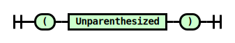

# layout.pegjs

## 

### Root

References: [Unparenthesized](#Unparenthesized)

### Unparenthesized

Used by: [Root](#Root), [Parenthesized](#Parenthesized)
References: [View](#View), [VerticalSplits](#VerticalSplits), [HorizontalSplits](#HorizontalSplits)

### View

Used by: [Unparenthesized](#Unparenthesized), [VerticalSplits](#VerticalSplits), [HorizontalSplits](#HorizontalSplits)
References: [Parenthesized](#Parenthesized), [Name](#Name), [Size](#Size)

### Parenthesized

Used by: [View](#View)
References: [Unparenthesized](#Unparenthesized)

### VerticalSplits

Used by: [Unparenthesized](#Unparenthesized)
References: [View](#View)

### HorizontalSplits

Used by: [Unparenthesized](#Unparenthesized)
References: [View](#View)

### Name

Used by: [View](#View)

### Size

Used by: [View](#View)

