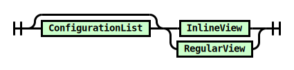

# view.pegjs

## 

### Root

References: [ConfigurationList](#ConfigurationList), [ViewType](#ViewType), [ResourceList](#ResourceList)

### ConfigurationList

Used by: [Root](#Root), [ConfigurationValue](#ConfigurationValue), [Resource](#Resource)
References: [Configuration](#Configuration)

### Configuration

Used by: [ConfigurationList](#ConfigurationList)
References: [ConfigurationKey](#ConfigurationKey), [ConfigurationValue](#ConfigurationValue)

### ConfigurationKey

Used by: [Configuration](#Configuration)

### ConfigurationValue

Used by: [Configuration](#Configuration)
References: [ConfigurationList](#ConfigurationList)

### ViewType

Used by: [Root](#Root)

### ResourceList

Used by: [Root](#Root)
References: [Resource](#Resource)

### Resource

Used by: [ResourceList](#ResourceList)
References: [ConfigurationList](#ConfigurationList), [ResourceValue](#ResourceValue)

### ResourceValue

Used by: [Resource](#Resource)

